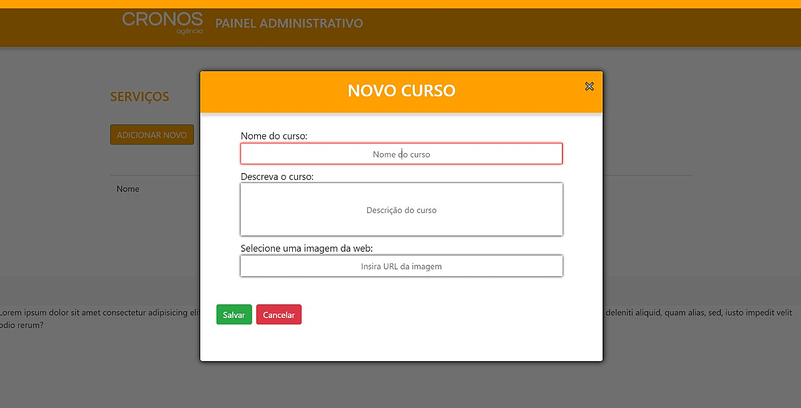
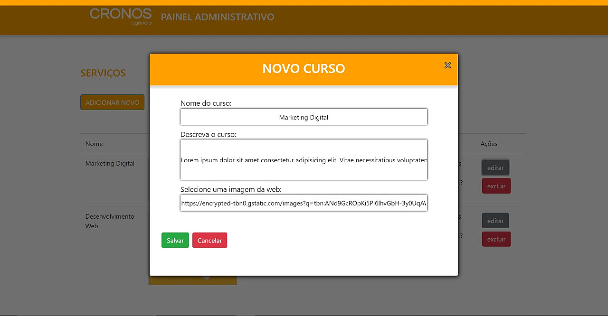
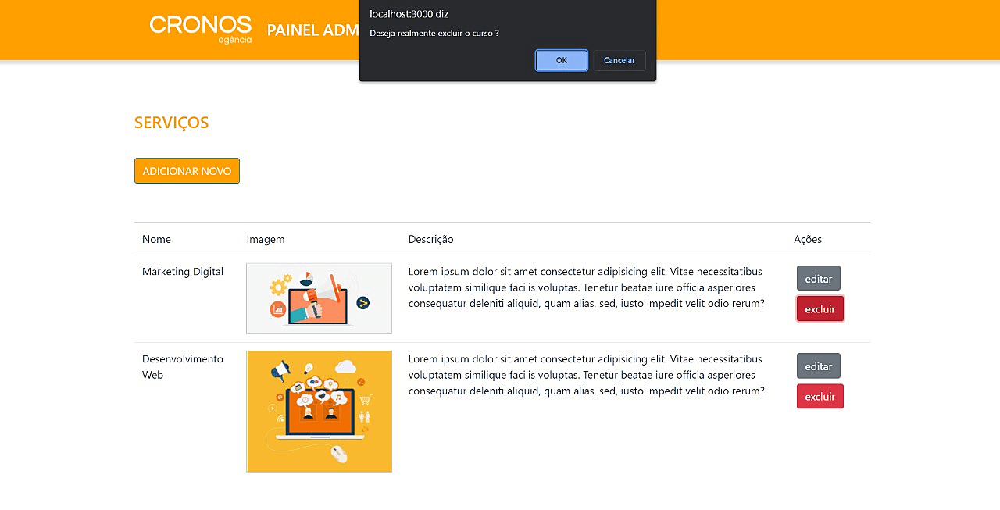

# Agência Cronos

## 2º Desafio Gama Academy em Grupo

### A proposta do desafio é trabalhar em trio e colocar em prática as habilidades adquiridas até o momento, sendo necessário Lógica da Programação, Javascript e React.

#

## Enunciado do Desafio

A **Agência Cronos** contratou vocês para o desenvolvimento do site institucional, o foco é no gerenciamento de serviços. A página inicial do Painel Administrativo,
já está com o HTML e CSS pronto para receber conteúdos dinamicamente.

O que vocês precisam fazer é dar continuidade ao desenvolvimento, pois precisamos de funcionalidades para **criar**, **editar** e **deletar** serviços da lista (o famoso CRUD).

Antes de criar as funções essenciais, lembre-se que todos os cursos devem ser armazenados em uma lista única, seja em um array ou em um arquivo JSON.

## Checklist de Requisitos Mínimos

1. Todos os códigos deverão estar em um repositório no **Github** de acesso público com todos os integrantes incluídos como colaboradores..
2. Renderizar a página utilizando React.
3. Ao carregar a página deve **exibir** a lista de serviços dinamicamente.
4. Ao clicar no botão **adicionar novo**, deve exibir o formulário de cadastro de serviço.
5. Ao clicar no botão **editar**, deve exibir o formulário preenchido com os dados do serviço escolhido e guardar as alterações quando clicar no botão **salvar**.
6. Ao clicar no botão **excluir**, deve remover o serviço escolhido.

## Requisitos Para a Avaliação

- Organização do time e distribuição de tarefas
- Repositório no Github com README.md (descrição do desafio)
- Exibição dinâmica de serviços
- Cadastro de serviço
- Alteração de serviços
- Deletar serviços

## Funcionalidades

**Fizemos como solicitado as funções CRUD.**

#### **Adicionar Novo:**

Essa função ao clicar serve para abrir o modal, ela exibe o formulário de cadastro de serviço para que as informações sejam inseridas. Elas permanecem em tela até posterior edição ou exclusão.

</img>

#### **Editar:**

Essa função ao clicar exibe o formulário preenchido com os dados do serviço escolhido para o usuário _editar_/alterar as informações salvas anteriormente no "banco de dados" e guardar as alterações ao clicar em _salvar_.

</img>

#### **Excluir:**

Função que ao clicar _exclui_ perante confirmação, todas as adicções/alterações no serviço escolhido.

</img>

## Tecnologias Usadas

</img>

</img>

</img>

</img>

</img>

# Desenvolvedores

📌 [Ágatha Lima](https://github.com/AgathaLima)

<a href="https://github.com/AgathaLima">
        

📌 [Ana Luiza Marques](https://github.com/AnaLuizaMarques)

<a href="https://github.com/AnaLuizaMarques">
        

📌 [Gustavo Morais](https://github.com/guhmorais)

<a href="https://github.com/guhmorais">
        
